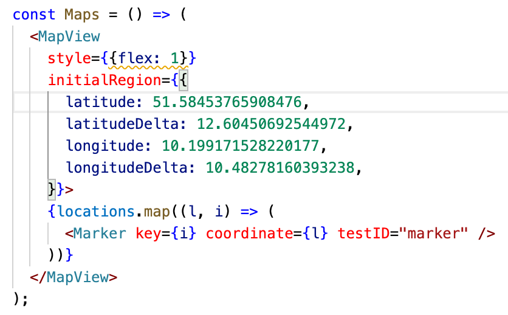
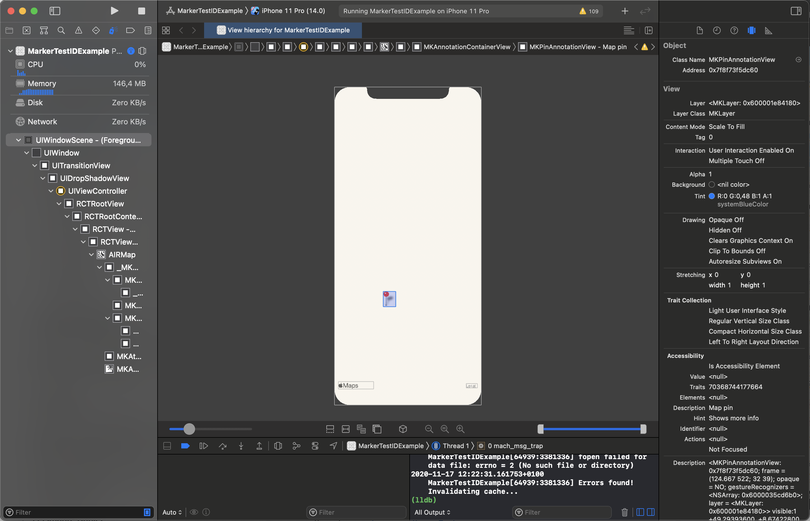

# react-native-maps-marker-test-id

To set up the example, run

```
$ yarn install
$ npx pod-install
```

To run the example, run

```
$ npx react-native run-ios
```

# Issue Description

`testID` for Markers is set in [src/components/Maps/index.js](src/components/Maps/index.js).



Markers are correctly renders in the simular:


However Xcode doesn't show the accessibility identifier:

